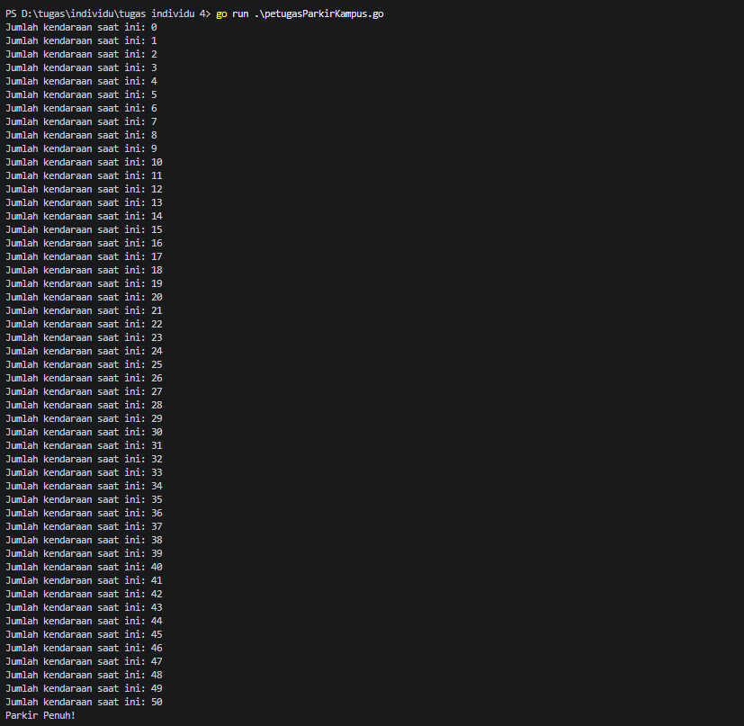

# Studi Kasus: Petugas Parkir Kampus
Seorang petugas parkir bertugas mencatat kendaraan yang masuk ke area parkir kampus setiap pagi. 
Petugas mulai mencatat dari kendaraan pertama, dan terus mencatat satu per satu setiap kendaraan yang 
datang, hingga akhirnya area parkir penuh (mencapai kapasitas maksimum 50 kendaraan). Begitu 
kendaraan ke-50 tercatat, petugas berhenti mencatat dan memasang papan "Parkir Penuh".

### Kode
```go
package main

import "fmt"

func main() {
	var kapasitasMaksimum = 50
	var kendaraan int

	for kendaraan = 0; kendaraan <= kapasitasMaksimum; kendaraan++ {
		fmt.Printf("Jumlah kendaraan saat ini: %d\n", kendaraan)
	} 
	fmt.Println("Parkir Penuh!")
}
```

### Penjelasan 
Proses pencatatan diatas dapat digambarkan menjadi sebuah proses pengulangan, karena petugas parkir mencatat jumlah kendaraan yang masuk secara terus menerus dan berulang-ulang sampai tempat parkir penuh (Jumlah kendaraan = kapasitas maksimum tempat parkir).
- Kalimat "Petugas mulai mencatat dari kendaraan pertama" merupakan titik atau nilai awal dari perulangan.
- Bagian cerita yang berperan sebagai kondisi berhenti yaitu "Begitu kendaraan ke-50 tercatat, petugas berhenti mencatat dan memasang papan 'Parkir Penuh'."
- Kalimat "dan terus mencatat satu per satu setiap kendaraan yang datang, hingga akhirnya area parkir penuh" adalah proses berulang yang terjadi dalam cerita.

### Output
